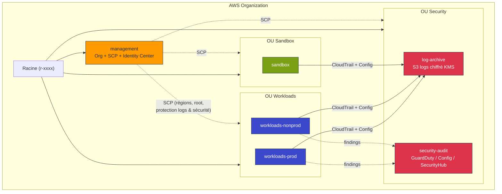

# 🏛️ Socle Landing Zone AWS multi-comptes

_Une fondation AWS multi-comptes sécurisée « by design », gouvernée par des Service Control Policies et industrialisée en Terraform/Terragrunt._


> Socle d'atterrissage prêt pour la production qui découpe AWS en comptes isolés
> (gestion, archivage des logs, audit sécurité, charges applicatives).
> Gouvernance centralisée, logging immuable et détection de menaces à l'échelle de l'organisation.

## 📋 Sommaire

- [🎯 Contexte & objectif](#-contexte--objectif)
- [🏗️ Architecture](#️-architecture)
- [🧱 Stack technique](#-stack-technique)
- [📁 Structure du dépôt](#-structure-du-dépôt)
- [✅ Prérequis](#-prérequis)
- [🚀 Démarrage rapide](#-démarrage-rapide)
- [🔑 Points clés d'implémentation](#-points-clés-dimplémentation)
- [📊 Observabilité](#-observabilité)
- [🔐 Sécurité](#-sécurité)
- [💰 Coûts & teardown](#-coûts--teardown)
- [🧪 Tests & validation](#-tests--validation)
- [🗺️ Roadmap](#️-roadmap)
- [🎓 Ce que ce projet démontre](#-ce-que-ce-projet-démontre)
- [📄 Licence](#-licence)

## 🎯 Contexte & objectif

Lorsqu'une organisation grandit sur AWS, le compte unique devient un risque :
isolation faible, blast radius énorme, quotas partagés et facturation illisible.
Ce projet met en place un **socle multi-comptes** (Landing Zone) qui sert de
fondation gouvernée à toutes les équipes.

Objectifs poursuivis :

- **Gouvernance** : une organisation AWS structurée en unités organisationnelles
  (OU), avec des garde-fous préventifs (Service Control Policies).
- **Sécurité by design** : moindre privilège, chiffrement systématique, logging
  immuable et détection de menaces activée partout.
- **IaC à l'échelle** : un code Terraform modulaire, orchestré par Terragrunt
  pour rester DRY sur tous les comptes, et validé par une CI sans clés statiques.

C'est une démonstration de posture **Architecte de solutions AWS** (découpage,
sécurité, résilience) couplée à une exécution **DevOps** (IaC, CI/CD, lint,
scan de sécurité).

## 🏗️ Architecture

L'organisation est découpée en un compte de gestion minimaliste et trois OU
(Security, Workloads, Sandbox). Tous les logs convergent, chiffrés, vers le
compte `log-archive` ; la détection de menaces est pilotée depuis
`security-audit` (administrateur délégué).



**Flux principaux :**

- **Logs**, un org-trail CloudTrail (multi-régions, validé) et AWS Config de
  chaque compte écrivent, chiffrés via KMS, dans un bucket S3 unique du compte
  `log-archive`, versionné et protégé contre la suppression par une SCP.
- **Menaces**, GuardDuty est activé au niveau de l'organisation depuis le compte
  `security-audit` ; les nouveaux comptes sont enrôlés automatiquement.
- **Garde-fous**, les SCP appliquées aux OU plafonnent les permissions
  (régions autorisées, interdiction du root, protection des services de
  sécurité et des buckets de logs).

Le détail des diagrammes et des flux figure dans
[`docs/architecture.md`](docs/architecture.md), et les décisions structurantes
dans [`docs/adr/`](docs/adr/).

## 🧱 Stack technique

| Composant | Rôle | Pourquoi ce choix |
| --- | --- | --- |
| **AWS Organizations** | Structure multi-comptes, OU et rattachement des SCP | Frontière d'isolation la plus forte d'AWS ; gouvernance centralisée |
| **Service Control Policies** | Garde-fous préventifs par OU | Plafonnent les permissions même pour les admins ; sécurité non contournable |
| **IAM Identity Center** | Accès fédéré (SSO) et permission sets | Supprime les utilisateurs IAM locaux et les clés statiques ; sessions courtes |
| **CloudTrail (org-trail)** | Journal d'audit de toute l'organisation | Un seul trail couvre tous les comptes, événements de gestion et de données |
| **AWS Config** | Inventaire et historique de configuration | Conformité et détection de dérive sur toutes les ressources |
| **Amazon S3 + KMS** | Stockage de logs chiffré et immuable | Versioning, lifecycle et chiffrement KMS avec rotation ; coffre-fort de preuves |
| **Amazon GuardDuty** | Détection de menaces à l'échelle org | Analyse continue sans agent ; auto-enable des nouveaux comptes |
| **Terraform** | Infrastructure as Code modulaire | Standard du marché, déclaratif, modules réutilisables |
| **Terragrunt** | Orchestration DRY de Terraform | Backend/provider générés une fois, dépendances et `run-all` |
| **GitHub Actions + OIDC** | CI (fmt, validate, lint, scan, plan) | Authentification AWS sans clés statiques ; garde-fous avant merge |
| **tflint / tfsec** | Lint et scan de sécurité statique | Détecte erreurs et mauvaises pratiques avant déploiement |

## 📁 Structure du dépôt

```text
01-aws-landing-zone/
├── README.md
├── LICENSE
├── Makefile                       # Cibles fmt / validate / plan / apply / destroy / lint / security-scan
├── .gitignore
├── docs/
│   ├── architecture.md            # Diagrammes Mermaid + flux détaillés
│   └── adr/
│       ├── 0001-strategie-multi-comptes.md
│       └── 0002-terragrunt-dry.md
├── .github/
│   └── workflows/
│       └── terraform-ci.yml       # fmt, init, validate, tflint, tfsec, plan (OIDC)
└── terraform/
    ├── modules/
    │   ├── organizations/         # Organisation, OU, comptes, délégations
    │   │   ├── main.tf
    │   │   ├── variables.tf
    │   │   └── outputs.tf
    │   ├── scp/                   # 4 Service Control Policies + attachements
    │   │   ├── main.tf
    │   │   ├── variables.tf
    │   │   └── outputs.tf
    │   ├── iam-identity-center/   # Permission sets + groupes + assignations
    │   │   ├── main.tf
    │   │   ├── variables.tf
    │   │   └── outputs.tf
    │   ├── logging/               # KMS + S3 + org-trail + AWS Config
    │   │   ├── main.tf
    │   │   ├── variables.tf
    │   │   └── outputs.tf
    │   └── guardduty/             # Détecteur org + auto-enable members
    │       ├── main.tf
    │       ├── variables.tf
    │       └── outputs.tf
    └── live/
        ├── terragrunt.hcl         # Racine : backend S3 + lock DynamoDB + generate provider
        ├── log-archive/
        │   └── logging/
        │       └── terragrunt.hcl
        └── security/
            └── guardduty/
                └── terragrunt.hcl
```

## ✅ Prérequis

| Outil | Version minimale | Rôle |
| --- | --- | --- |
| Terraform | `>= 1.6.0` | Moteur IaC |
| Terragrunt | `>= 0.55.0` | Orchestration DRY |
| AWS CLI | `>= 2.13` | Authentification et bootstrap |
| tflint | `>= 0.50` | Lint Terraform |
| tfsec | `>= 1.28` | Scan de sécurité statique |
| Make | `>= 3.81` | Exécution des cibles utilitaires |

Également requis :

- Un **compte de gestion** AWS avec les droits d'administrer l'organisation.
- Des **adresses e-mail uniques** pour chaque compte membre à créer.
- **IAM Identity Center activé** dans le compte de gestion (prérequis du module
  `iam-identity-center`).

## 🚀 Démarrage rapide

> Les commandes ci-dessous s'exécutent depuis le dossier `01-aws-landing-zone/`.

**1. Provisionner le backend distant (bootstrap, une seule fois)**

Le state Terragrunt vit dans un bucket S3 chiffré, verrouillé par une table
DynamoDB. Créez-les dans le compte de gestion :

```bash
aws s3api create-bucket \
  --bucket acme-landing-zone-tfstate \
  --region eu-west-1 \
  --create-bucket-configuration LocationConstraint=eu-west-1

aws s3api put-bucket-versioning \
  --bucket acme-landing-zone-tfstate \
  --versioning-configuration Status=Enabled

aws s3api put-bucket-encryption \
  --bucket acme-landing-zone-tfstate \
  --server-side-encryption-configuration \
  '{"Rules":[{"ApplyServerSideEncryptionByDefault":{"SSEAlgorithm":"aws:kms"}}]}'

aws dynamodb create-table \
  --table-name acme-landing-zone-tflock \
  --attribute-definitions AttributeName=LockID,AttributeType=S \
  --key-schema AttributeName=LockID,KeyType=HASH \
  --billing-mode PAY_PER_REQUEST \
  --region eu-west-1
```

**2. Adapter la configuration**

- Renseignez les e-mails des comptes et l'`management_account_id` dans
  `terraform/live/terragrunt.hcl` et les `inputs` des composants.
- Ajustez `state_bucket`, `state_lock_table` et `aws_region` selon votre nommage.

**3. Initialiser et valider**

```bash
make fmt        # formatage
make validate   # validation de tous les modules via Terragrunt
make lint       # tflint
make security-scan  # tfsec
```

**4. Planifier puis appliquer**

```bash
make plan       # terragrunt run-all plan
make apply      # terragrunt run-all apply (respecte les dépendances)
```

L'ordre d'application est résolu automatiquement par Terragrunt : l'organisation
et les comptes d'abord, puis le logging et GuardDuty qui en dépendent.

## 🔑 Points clés d'implémentation

- **Service Control Policies (4 garde-fous)**, `terraform/modules/scp/main.tf` :
  interdiction de désactiver CloudTrail/GuardDuty/Config/Security Hub,
  restriction aux régions autorisées (avec exception des services globaux),
  interdiction de l'utilisateur root, et protection des buckets de logs contre
  la suppression et l'altération.

- **Logging centralisé & immuable**, `terraform/modules/logging/main.tf` : un
  org-trail multi-régions avec validation des fichiers, un bucket S3 chiffré KMS
  (rotation activée), versionné, bloquant l'accès public et le trafic non TLS,
  doté d'un cycle de vie (IA → Glacier → expiration ~7 ans). AWS Config y livre
  ses snapshots et son historique.

- **Séparation des comptes**, `terraform/modules/organizations/main.tf` : compte
  de gestion sans charge applicative, `log-archive` et `security-audit` séparés
  (stockage des preuves ≠ analyse), workloads isolés par environnement.
  `security-audit` est administrateur délégué de GuardDuty, Config et Security
  Hub.

- **OIDC, zéro clé statique**, `.github/workflows/terraform-ci.yml` : la CI
  assume un rôle AWS via `aws-actions/configure-aws-credentials` avec
  `id-token: write`. Aucune `AWS_ACCESS_KEY_ID` n'est stockée dans GitHub.

- **DRY via Terragrunt**, `terraform/live/terragrunt.hcl` : backend S3 + verrou
  DynamoDB définis une fois, provider et versions **générés**, clés d'état
  dérivées du chemin, dépendances déclarées entre composants.

## 📊 Observabilité

- **CloudTrail** : journal d'audit centralisé de toute l'organisation
  (événements de gestion + données S3/Lambda), avec validation d'intégrité des
  fichiers. Source de vérité pour « qui a fait quoi, quand, depuis où ».
- **AWS Config** : inventaire continu et historique de configuration de toutes
  les ressources supportées ; base pour la conformité et la détection de dérive.
- **GuardDuty** : findings de sécurité (reconnaissance, exfiltration,
  credentials compromis, crypto-mining…) publiés toutes les 15 minutes,
  agrégés dans `security-audit`. Protection EKS et anti-malware EBS activées.
- **Pistes d'extension** : agrégation des findings dans **Security Hub**,
  notifications via **EventBridge → SNS/Slack**, et tableaux de bord de
  conformité (voir [Roadmap](#️-roadmap)).

## 🔐 Sécurité

- **Moindre privilège** : accès humains via IAM Identity Center uniquement,
  permission sets dédiés (Administrator, ReadOnly, Billing) et sessions courtes
  (1 h pour l'administration). Pas d'utilisateurs IAM locaux ni de clés longues.
- **Chiffrement** : logs chiffrés au repos avec KMS (rotation automatique),
  trafic non TLS refusé par la policy du bucket, state Terraform chiffré dans S3.
- **Garde-fous SCP** : protections non contournables même par un administrateur
  (services de sécurité, régions, root, buckets de logs).
- **Immuabilité des preuves** : bucket de logs versionné, accès public bloqué,
  suppression refusée par SCP ; stockage séparé de l'analyse.
- **Surface d'attaque réduite** : compte de gestion sans charge applicative ;
  CI sans secret statique grâce à OIDC.

Toutes les ressources passent par `tfsec` en CI, qui échoue le pipeline en cas
de finding non corrigé.

## 💰 Coûts & teardown

Estimation indicative pour un socle de démonstration peu sollicité (région
`eu-west-1`, hors trafic applicatif) :

| Service | Hypothèse | Coût estimé / mois |
| --- | --- | --- |
| AWS Organizations | Gratuit | 0 $ |
| CloudTrail (org-trail) | 1er trail de gestion gratuit ; événements de données facturés | ~1–5 $ |
| Stockage S3 des logs | Quelques Go, lifecycle vers Glacier | ~1–3 $ |
| KMS | 1 clé + requêtes de chiffrement | ~1–2 $ |
| AWS Config | Éléments de configuration enregistrés | ~2–8 $ |
| GuardDuty | Analyse des logs (volume faible) | ~3–10 $ |
| DynamoDB (state lock) | PAY_PER_REQUEST, usage CI | < 1 $ |
| **Total indicatif** | | **~10–30 $ / mois** |

> ⚠️ **Avertissement** : ces montants varient fortement avec le volume d'événements
> de données CloudTrail, le nombre de ressources suivies par Config et le trafic
> analysé par GuardDuty. Surveillez les coûts via le permission set `Billing`.

**Teardown :**

```bash
make destroy    # terragrunt run-all destroy
```

> ⚠️ **Opération destructrice.** `make destroy` supprime les ressources du socle.
> Le bucket de logs est **protégé par une SCP** : il faut d'abord détacher la SCP
> `deny-delete-log-buckets`, vider le bucket (objets et versions), et le
> `close_on_deletion` des comptes est volontairement à `false` (la fermeture de
> comptes AWS reste une action manuelle et réfléchie). Ne lancez jamais ce
> teardown sur un environnement contenant des preuves d'audit à conserver.

## 🧪 Tests & validation

Pile de validation, exécutée localement et en CI :

- `terraform fmt -recursive -check`, formatage homogène.
- `terraform validate` (par module), cohérence syntaxique et de typage.
- `tflint`, bonnes pratiques et erreurs courantes (provider AWS).
- `tfsec`, scan de sécurité statique (chiffrement, accès public, etc.).
- `terragrunt run-all plan`, plan de bout en bout sur les PR, avec
  `mock_outputs` pour résoudre les dépendances hors ligne, publié en commentaire
  de pull request.

Les `variable "validation"` des modules (formats d'e-mail, régions non vides,
permission sets autorisés, rétention minimale) ajoutent une couche de
vérification au plus tôt.

## 🗺️ Roadmap

- [ ] Agréger les findings dans **AWS Security Hub** + standards CIS/AWS FSBP.
- [ ] Notifications **EventBridge → SNS/Slack** sur findings GuardDuty critiques.
- [ ] **AWS Config conformance packs** (CIS, PCI-DSS) déployés par OU.
- [ ] **VPC partagé** via Resource Access Manager et réseau hub-and-spoke.
- [ ] **IPAM** centralisé pour le plan d'adressage.
- [ ] Génération automatique de la doc des modules avec **terraform-docs**.
- [ ] Tests d'intégration avec **Terratest** ou **OpenTofu test**.
- [ ] Migration optionnelle vers **AWS Control Tower** pour comparaison.

## 🎓 Ce que ce projet démontre

**Domaines AWS Solutions Architect (SAA) :**

- **Conception sécurisée d'architectures** : séparation des comptes, moindre
  privilège, chiffrement KMS, garde-fous SCP, accès fédéré SSO.
- **Conception résiliente** : isolation du blast radius par compte, immuabilité
  et versioning des logs, quotas isolés.
- **Conception performante et évolutive** : modèle d'organisation qui passe à
  l'échelle (OU, auto-enable des comptes), lifecycle S3 adapté.
- **Optimisation des coûts** : facturation lisible par compte, lifecycle vers
  Glacier, suivi via permission set Billing.

**Compétences DevOps / Platform Engineering :**

- **Infrastructure as Code** modulaire et réutilisable (Terraform).
- **DRY & orchestration** multi-comptes (Terragrunt, `run-all`, dépendances).
- **CI/CD** avec garde-fous (fmt, validate, lint, scan de sécurité, plan sur PR).
- **Sécurité de la chaîne CI** : authentification **OIDC** sans clés statiques.
- **Documentation d'architecture** : diagrammes Mermaid et **ADR** justifiant
  les décisions structurantes.

## 📄 Licence

Distribué sous licence **MIT**. Voir le fichier [`LICENSE`](LICENSE) pour les
détails.

© 2026 Noumabeu Moutacdie Jordan.
