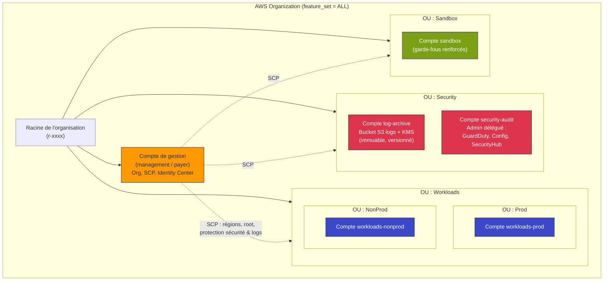
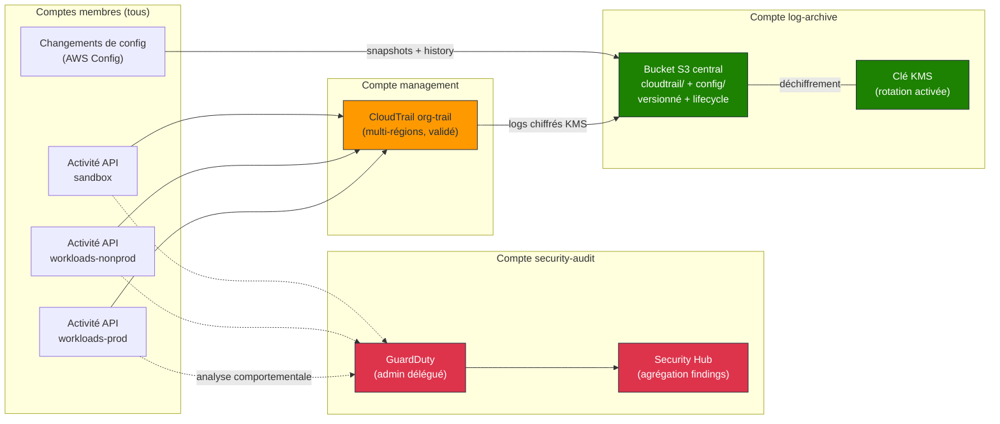

# Architecture, Socle Landing Zone multi-comptes

Ce document décrit l'organisation AWS multi-comptes mise en place par ce socle,
ainsi que les flux de logs centralisés vers le compte `log-archive`.

## Vue d'ensemble de l'organisation

### Description des comptes

| Compte | OU | Rôle |
| --- | --- | --- |
| `management` | Racine | Compte payeur, héberge l'organisation, les SCP et IAM Identity Center. Surface d'attaque minimale : aucune charge applicative. |
| `log-archive` | Security | Coffre-fort des logs : bucket S3 chiffré KMS, versionné et protégé par SCP. Accès en écriture seule pour les services. |
| `security-audit` | Security | Administrateur délégué de GuardDuty, AWS Config et Security Hub. Console unique pour les équipes sécurité. |
| `workloads-prod` | Workloads/Prod | Charges de production, isolées dans leur propre frontière de facturation et de blast radius. |
| `workloads-nonprod` | Workloads/NonProd | Dev, test et pré-production. |
| `sandbox` | Sandbox | Expérimentation libre encadrée par des SCP plus strictes (régions, budgets). |

## Flux de logs centralisés

Tous les journaux d'audit convergent vers le compte `log-archive`, qui n'est
accessible en écriture que par les services AWS et jamais modifiable par les
équipes applicatives (garanti par SCP).

### Explication des flux

1. **CloudTrail (org-trail)** : un unique trail créé dans le compte de gestion
   capture les événements de gestion **et** de données (S3, Lambda) de **tous**
   les comptes de l'organisation. Les fichiers sont chiffrés via une clé KMS du
   compte `log-archive` puis déposés sous le préfixe `cloudtrail/` du bucket
   central. La validation des fichiers de log (`enable_log_file_validation`)
   garantit leur intégrité.

2. **AWS Config** : dans chaque compte, l'enregistreur capture la configuration
   et l'historique des changements de toutes les ressources supportées, puis les
   livre sous le préfixe `config/` du même bucket central.

3. **Chiffrement & immuabilité** : la clé KMS a la rotation automatique activée.
   Le bucket est versionné, bloque tout accès public, refuse les connexions non
   TLS, et applique un cycle de vie (transition `STANDARD_IA` à 90 j, `GLACIER`
   à 180 j, expiration à ~7 ans). Une SCP empêche toute suppression du bucket ou
   de ses objets, y compris par un administrateur.

4. **GuardDuty & Security Hub** : le compte `security-audit` est administrateur
   délégué. GuardDuty analyse en continu les logs CloudTrail, VPC Flow Logs et
   DNS de tous les comptes ; les nouveaux comptes sont enrôlés automatiquement.
   Security Hub agrège les findings pour offrir une vue de conformité unique.

### Principe de séparation des privilèges

- Le **compte de gestion** ne porte aucune charge applicative : il sert
  uniquement à la gouvernance (organisation, SCP, SSO). Cela réduit
  drastiquement sa surface d'attaque.
- Le **stockage des logs** (log-archive) est séparé de leur **analyse**
  (security-audit), de sorte qu'une compromission de la console d'analyse ne
  permet pas d'altérer les preuves.
- Les **workloads** sont isolés par environnement, chaque compte constituant une
  frontière naturelle de blast radius, de quotas et de facturation.
